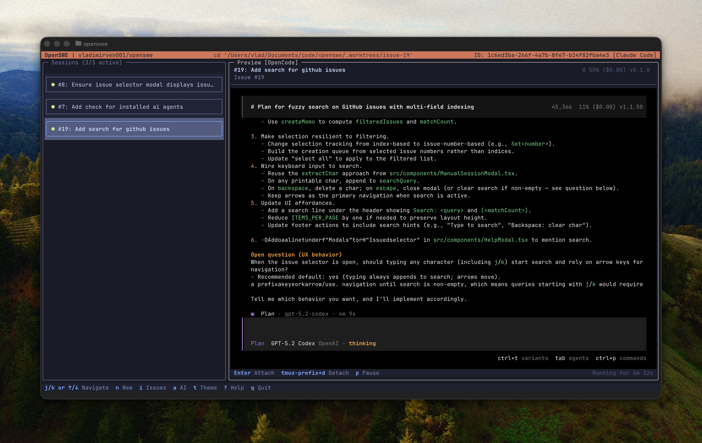

# openswe

openswe is an AI coding agent (opencode, claude code) orchestration tool. It connects to github, fetches open issues, and starts working on them for you.



## Requirements

Before running openswe, ensure you have the following installed:

- **Git**: For version control operations.
- **GitHub CLI (`gh`)**: Must be installed and authenticated (`gh auth login`).
- **tmux**: Required for session management and isolation.

## Installation

### macOS & Linux (Homebrew)

```bash
brew install vladimirven001/tap/openswe
```

### NPM / Bun (Global)

You can also install `openswe` globally using your preferred Node.js package manager:

```bash
# npm
npm install -g @vladimirven/openswe

# bun
bun add -g @vladimirven/openswe
```

## Usage

Start openswe in your project directory:

```bash
openswe
```

Or specify a repository directly:

```bash
openswe --repo owner/repo
```

### Common Options

- `--repo <owner/repo>`: Start on a specific GitHub repository.
- `--backend <name>`: Choose AI backend (`opencode` or `claude`).
- `--help`: Show all available options.

## How It Works

OpenSWE detects your current context to determine how to proceed:

1.  **Existing Project**: If run in a folder with `.openswe/`, it loads the existing project state.
2.  **Git Repo**: If run in a Git repository, it offers to adopt it.
3.  **New Setup**: If run in an empty folder, it launches a setup wizard.
